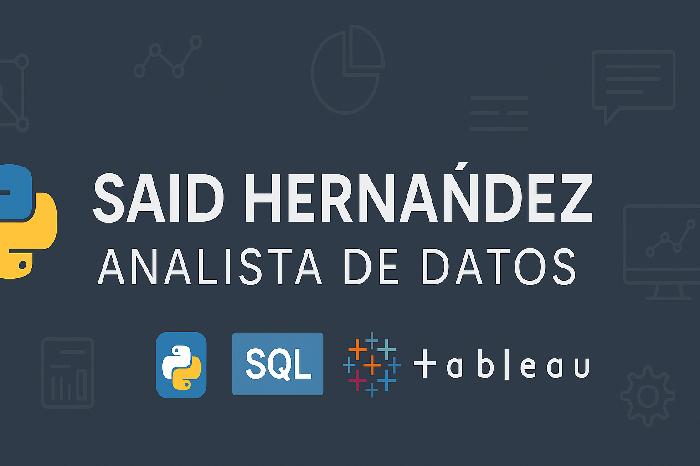

<!-- Banner -->

# 👋 ¡Hola! Soy **Said Hernández**

### 💼 Analista de Datos | Python · SQL · Tableau · Excel

---

## 🧠 Sobre mí

Apasionado por el análisis de datos y la tecnología.  
Me especializo en **transformar información en decisiones estratégicas** mediante el uso de herramientas analíticas y visualización de datos.  

📊 Tengo más de **5 años de experiencia** trabajando con datos en el sector institucional y tecnológico.  
🚀 Mi objetivo es seguir creciendo en el área de **Data Analytics**, desarrollando soluciones que optimicen procesos y aporten valor a la toma de decisiones.  
💡 Actualmente desarrollo proyectos en **Python**, **SQL** y **Tableau**, centrados en automatización y eficiencia de reportes.  

---

## 🛠️ Lenguajes y Herramientas

| Python 🐍 | SQL 🧩 | Tableau 📊 | Excel ⚙️ | Pandas 🧮 | Power BI 🔶 |
|-----------|--------|-------------|------------|-------------|-------------|

---

## 📈 Mis estadísticas

  

---

## 📫 Contacto

📍 **Ubicación:** Michoacán, México  
🔗 **LinkedIn:** [linkedin.com/in/said-alfredo-hernandez-aguilera-08529038b](https://www.linkedin.com/in/said-alfredo-hernandez-aguilera-08529038b)  
✉️ **Email:** said.hernandeza@imss.gob.mx  

---

## 💬 Frase personal

> *“Los datos cuentan una historia... mi trabajo es ayudar a interpretarla.”*

---

⭐️ *Desarrollado por Said Hernández — Analista de Datos*
